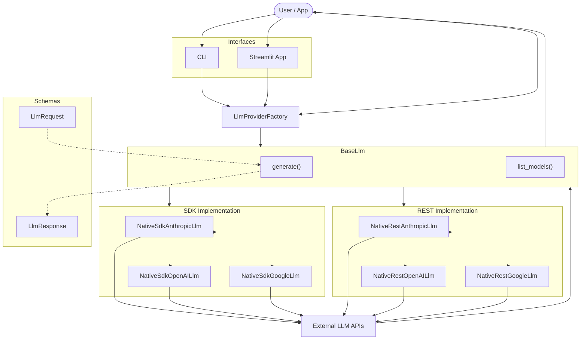

# Relay 🔁

> A minimal unified Python interface for LLMs.

One request schema. One response schema. Swap providers without touching your application code.

Implementations are available via both **SDK** (direct) and **REST** (from scratch via httpx) — so you can see exactly what provider libraries are doing under the hood.


---

## Install

### Approach 1: GitHub
```bash
git clone https://github.com/siddarthanath/relay
cd relay
pip install -e .
```

### Approach 2: PyPI
```bash
pip install relay
```

---

## Architecture



---

## Usage

### 1a. Basic generation

Use the **factory** when you supply the API key yourself at call time:

```python
# Imports
from relay.llm import LlmProviderFactory
from relay.llm.schemas import LlmRequest, LlmMessage, Role
# Arrange (LLM creation)
llm = LlmProviderFactory.create(provider_type="google",
                                api_key="AIza...",
                                model_name="gemini-2.5-flash",
                                implementation="sdk")
request = LlmRequest(messages=[LlmMessage(role=Role.user, 
                                          content="Explain transformers in one paragraph.")
                              ],
                     temperature=0.7)
# Act (LLM generation)
response = await llm.generate(request)
print(response.content)
```

Use the **registry** when keys live in a `.env` file - configure once, fetch anywhere:

```python
# Imports
from relay.llm import LlmProviderRegistry
from relay.llm.schemas import LlmRequest, LlmMessage, Role
# Arrange (LLM creation)
registry = LlmProviderRegistry(env_file=".env")
llm = registry.get("google")   # Default implementation is sdk
request  = LlmRequest(messages=[LlmMessage(role=Role.user, 
                                           content="Explain transformers in one paragraph.")
                               ],
                      temperature=0.7)
# Act (LLM generation)
response = await llm.generate(request)
print(response.content)
```

### 1b. Context manager

Use `async with` to ensure the underlying HTTP client is closed when you're done:

```python
# Imports
from relay.llm import LlmProviderFactory
from relay.llm.schemas import LlmRequest, LlmMessage, Role
# Arrange (LLM creation)
llm = LlmProviderFactory.create(provider_type="openai",
                                api_key="sk-...",
                                model_name="gpt-4o")
request = LlmRequest(messages=[LlmMessage(role=Role.user,
                                          content="Explain transformers in one paragraph.")
                              ],
                     temperature=0.7)
# Act (LLM generation) — client is closed automatically on exit
async with llm:
    response = await llm.generate(request)
    print(response.content)
```


### 2. Listing available models

```python
llm = LlmProviderFactory.create(provider_type="google", 
                                api_key="AIza...")
models = await llm.list_models()
print(models)
```

### 3. Streaming

```python
async for chunk in await llm.generate(request, stream=True):
    print(chunk, end="", flush=True)
```

### 4. System prompts

```python
request = LlmRequest(messages=[LlmMessage(role=Role.user, 
                                          content="Summarise this.")
                              ],
                     system_prompt="You are a concise technical writer.")
```

### 5. Switching providers

```python
# Same request, different provider — no other changes needed
llm = LlmProviderFactory.create(provider_type="anthropic", 
                                api_key="sk-ant-...", 
                                model_name="claude-sonnet-4-20250514")
response = await llm.generate(request)
```

### 6. Switching implementations

```python
# Same provider, REST instead of SDK — useful for understanding what's happening on the wire
llm = LlmProviderFactory.create(provider_type="openai", 
                                api_key="sk-..."
                                model_name="gpt-4o-mini",
                                implementation="rest")
```

---

## Interfaces

Relay ships with two ready-made interfaces for interacting with any provider directly.

**CLI**
```bash
python -m relay.cli
```

**Streamlit app**
```bash
streamlit run relay/app.py
```

Both prompt for provider, implementation (sdk/rest), and API key at launch - nothing hardcoded, nothing stored. The Streamlit app pulls a live model list from the provider so you always see what's available.

---

## Roadmap

| Version | Feature | Status |
|:---:|:---| :---|
| v1 | Non-streaming, streaming, system prompts - SDK + REST | ✓
| v2 | Thinking mode (o1, Claude extended thinking) | ✗
| v3 | Tool and function calling | ✗
| v4 | Image generation | ✗
| v5 | Voice generation | ✗

---

## Citation

If you use Relay in your work, please cite:

```text
@software{relay2026,
  author = {Siddartha Nath},
  title = {Relay: A Minimal Unified Python Interface for LLMs},
  year = {2026},
  url = {https://github.com/siddarthanath/relay}
}
```