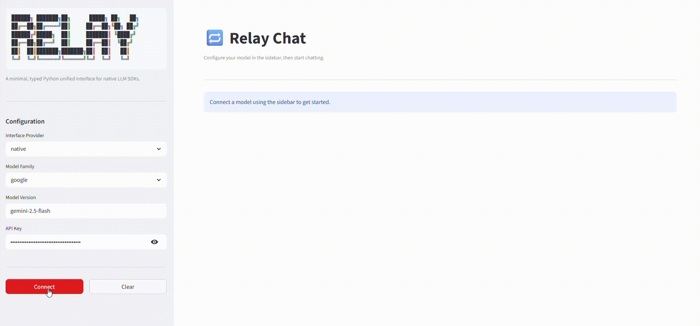

# Relay 🔁

> A minimal, typed Python unified interface for native LLM SDKs.

One request schema. One response schema. Swap providers without touching your application code.



---

## Why

- LangChain is powerful but heavy.
- LiteLLM is comprehensive but complex.

Sometimes you just want a clean, typed abstraction over the different providers you actually use, directly from the provider API - with streaming, system prompts, and proper response metadata - and nothing else. Relay is that!

---

## Install

### Approach 1: GitHub
```bash
git clone https://github.com/siddarthanath/relay
cd relay
pip install -e .
```

### Approach 2: PyPI
```bash
pip install relay
```

---

## Usage

### Basic generation

```python
# Imports
from relay.llm.factory import LLMProviderFactory
from relay.llm.schemas import LlmRequest, LlmMessage, Role
# Arrange (factory instantiation)
llm = LLMProviderFactory.create(model="anthropic", api_key="sk-ant-...", model_name="claude-haiku-4.5")
user_request = LlmRequest(messages=[LlmMessage(role=Role.user,
                                               content="Explain transformers in one paragraph.")],
                          temperature=0.7,)
# Act (execute response method)
response = await llm.generate(user_request)
print(response.content)
```

### Streaming

```python
async for chunk in await llm.generate(request, stream=True):
    print(chunk, end="", flush=True)
```

### System prompts

```python
request = LlmRequest(
    messages=[LlmMessage(role=Role.user, content="Summarise this.")],
    system_prompt="You are a concise technical writer.",
)
```

### Switching providers

```python
# Same request, different provider — no other changes needed
llm = LLMProviderFactory.create(model="google", api_key="AIza...", model_name="gemini-2.5.flash")
response = await llm.generate(request)
```

---

## Interfaces

Relay ships with two ready-made interfaces for interacting with any provider directly.

**CLI**
```bash
python -m relay.cli
```

**Streamlit app**
```bash
streamlit run relay/app.py
```

Both prompt for API key and model at launch — nothing hardcoded, nothing stored.

---

## Supported providers

| Provider  | Non-streaming | Streaming | System prompt | Thinking mode |
|-----------|:---:|:---:|:---:|:---:|
| Anthropic | ✓ | ✓ | ✓ | soon |
| OpenAI    | ✓ | ✓ | ✓ | soon |
| Google    | ✓ | ✓ | ✓ | soon |

---

## Citation

If you use Relay in your work, please cite:

@software{relay2026,
  author = {Siddartha Nath},
  title = {Relay: A Minimal Typed Python Unified Interface for LLMs},
  year = {2026},
  url = {https://github.com/siddarthanath/relay}
}
