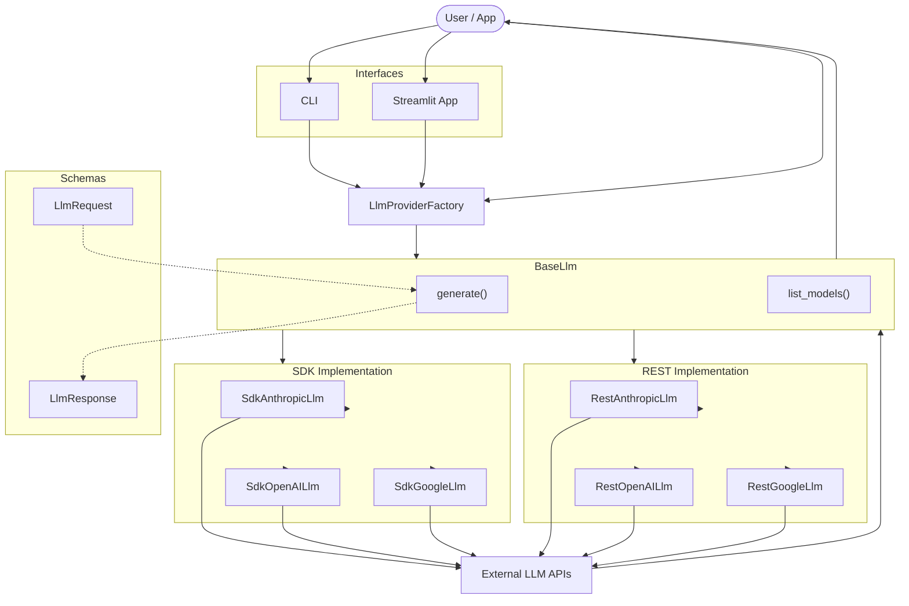

```mermaid
flowchart TD
    User(["User / App"])

    subgraph Interfaces
        CLI["CLI"]
        ST["Streamlit App"]
    end

    subgraph Schemas
        REQ["LlmRequest"]
        RESP["LlmResponse"]
    end

    Factory["LlmProviderFactory"]

    subgraph Base["BaseLlm"]
        GEN["generate()"]
        LIST["list_models()"]
    end

    subgraph SDK["SDK Implementation"]
        SDK_A["SdkAnthropicLlm"]
        SDK_O["SdkOpenAILlm"]
        SDK_G["SdkGoogleLlm"]
    end

    subgraph REST["REST Implementation"]
        REST_A["RestAnthropicLlm"]
        REST_O["RestOpenAILlm"]
        REST_G["RestGoogleLlm"]
    end

    LLMs["External LLM APIs"]

    User --> CLI
    User --> ST
    CLI --> Factory
    ST --> Factory
    User --> Factory
    Factory --> Base
    Base --> SDK
    Base --> REST
    SDK --> SDK_A
    SDK --> SDK_O
    SDK --> SDK_G
    REST --> REST_A
    REST --> REST_O
    REST --> REST_G
    SDK_A --> LLMs
    SDK_O --> LLMs
    SDK_G --> LLMs
    REST_A --> LLMs
    REST_O --> LLMs
    REST_G --> LLMs
    LLMs --> Base
    Base --> User
    REQ -.-> GEN
    GEN -.-> RESP
```